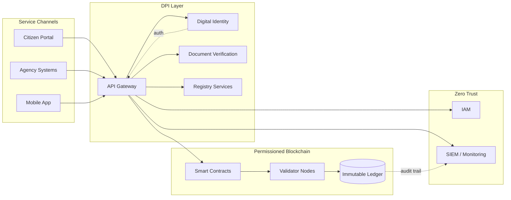
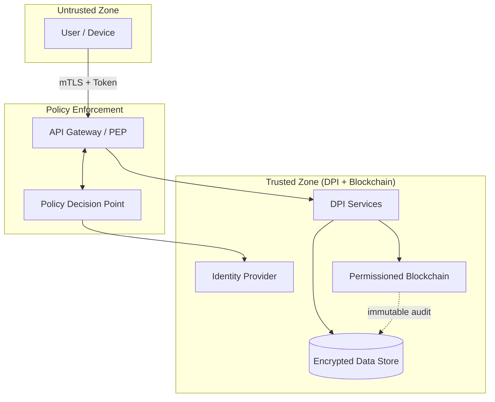
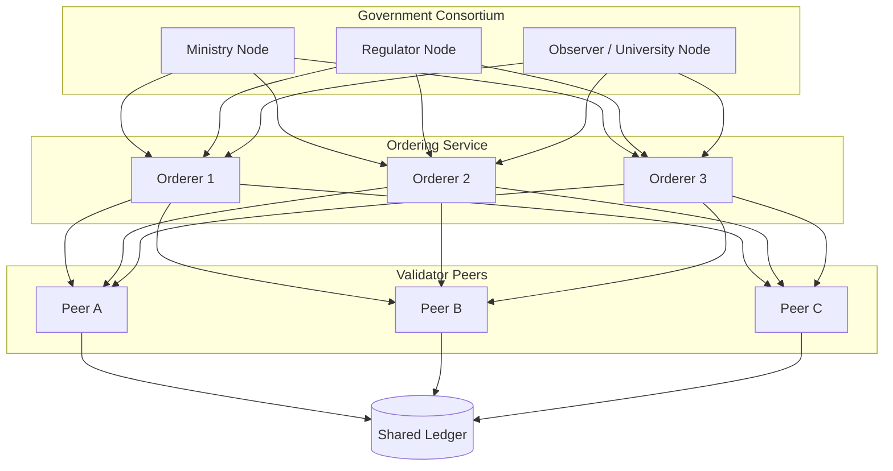
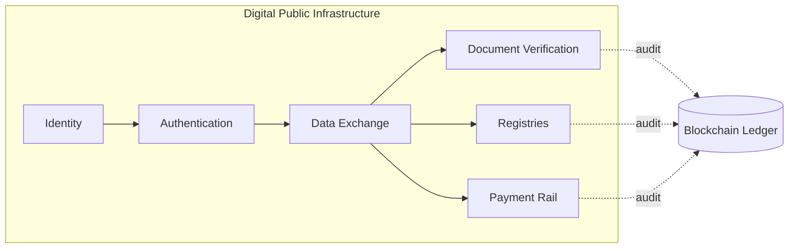

# Blockchain & DPI Architecture

## 1. Blockchain + DPI Integration Flow

```mermaid
flowchart LR
    subgraph Channels["Service Channels"]
        C1[Citizen Portal]
        C2[Agency Systems]
        C3[Mobile App]
    end
    subgraph DPI["DPI Layer"]
        ID[Digital Identity]
        GW[API Gateway]
        DOC[Document Verification]
        REG[Registry Services]
    end
    subgraph BC["Permissioned Blockchain"]
        SC[Smart Contracts]
        VAL[Validator Nodes]
        LEDGER[(Immutable Ledger)]
    end
    subgraph Sec["Zero Trust"]
        IAM[IAM]
        SIEM[SIEM / Monitoring]
    end
    C1 & C2 & C3 --> GW
    GW --> ID
    GW --> DOC
    GW --> REG
    GW --> SC
    SC --> VAL
    VAL --> LEDGER
    ID -.auth.-> GW
    GW --> IAM
    GW --> SIEM
    LEDGER -.audit trail.-> SIEM
```

## 2. Trust Boundary + Data Flow

```mermaid
flowchart TB
    subgraph Untrusted["Untrusted Zone"]
        U[User / Device]
    end
    subgraph Edge["Policy Enforcement"]
        PEP[API Gateway / PEP]
        PDP[Policy Decision Point]
    end
    subgraph Trusted["Trusted Zone (DPI + Blockchain)"]
        IDP[Identity Provider]
        DPIAPP[DPI Services]
        CHAIN[Permissioned Blockchain]
        DATA[(Encrypted Data Store)]
    end
    U -->|mTLS + Token| PEP
    PEP <--> PDP
    PDP --> IDP
    PEP --> DPIAPP
    DPIAPP --> CHAIN
    DPIAPP --> DATA
    CHAIN -.immutable audit.-> DATA
```

## 3. Blockchain Topology (Consortium)

```mermaid
flowchart TB
    subgraph Gov["Government Consortium"]
        M1[Ministry Node]
        M2[Regulator Node]
        M3[Observer / University Node]
    end
    subgraph Orderers["Ordering Service"]
        O1[Orderer 1]
        O2[Orderer 2]
        O3[Orderer 3]
    end
    subgraph Peers["Validator Peers"]
        P1[Peer A]
        P2[Peer B]
        P3[Peer C]
    end
    LEDGER[(Shared Ledger)]
    M1 & M2 & M3 --> O1 & O2 & O3
    O1 & O2 & O3 --> P1 & P2 & P3
    P1 & P2 & P3 --> LEDGER
```

## 4. DPI Component Map

```mermaid
flowchart LR
    subgraph DPI["Digital Public Infrastructure"]
        ID[Identity]
        AUTH[Authentication]
        EX[Data Exchange]
        DOC[Document Verification]
        REG[Registries]
        PAY[Payment Rail]
    end
    ID --> AUTH
    AUTH --> EX
    EX --> DOC
    EX --> REG
    EX --> PAY
    DOC & REG & PAY -.audit.-> LEDGER[(Blockchain Ledger)]
```
